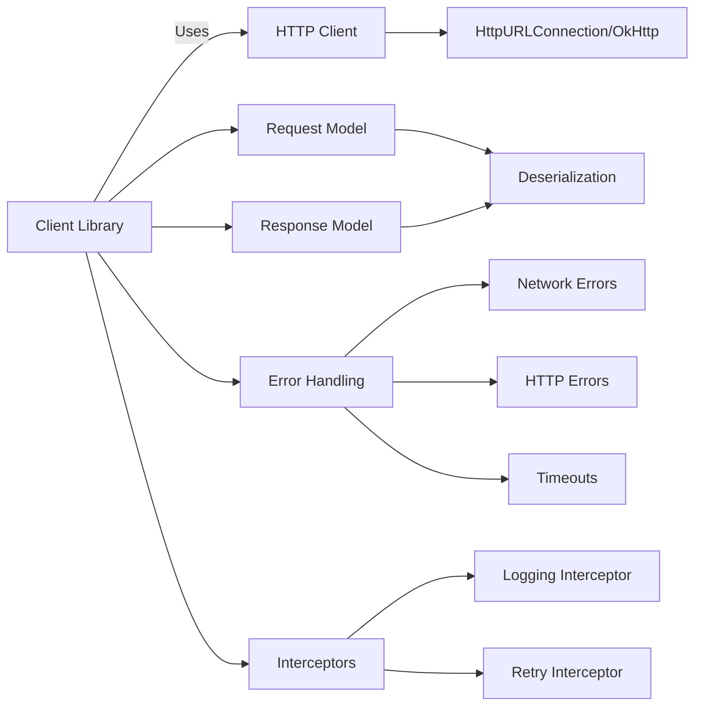
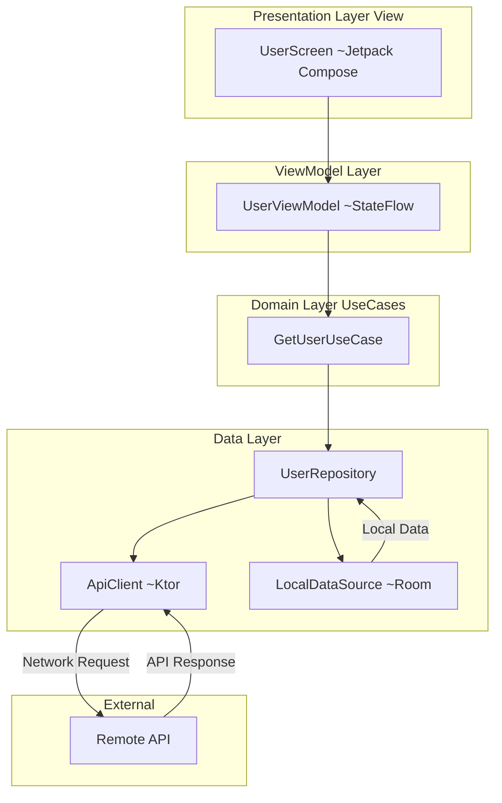

# System Design for software 

## 1 Andrfoid own Api client using okhttp abastraction layer 

```mermaid
flowchart LR
    A[Client Library] -->|Uses| B[HTTP Client]
    B --> C[HttpURLConnection/OkHttp]
    A --> D[Request Model]
    A --> E[Response Model]
    D --> F[Serialization]
    E --> F[Deserialization]
    A --> G[Error Handling]
    A --> H[Interceptors]
    G --> I[Network Errors]
    G --> J[HTTP Errors]
    G --> K[Timeouts]
    H --> L[Logging Interceptor]
    H --> M[Retry Interceptor]
```

## Modern Android MVVM Pattern 

```mermaid

flowchart TD
    subgraph Presentation Layer View
        A[UserScreen ~Jetpack Compose]
    end

    subgraph ViewModel Layer
        B[UserViewModel ~StateFlow]
    end

    subgraph Domain Layer UseCases
        C[GetUserUseCase]
    end

    subgraph Data Layer
        D[UserRepository]
        E[ApiClient ~Ktor]
        F[LocalDataSource ~Room]
    end

    subgraph External
        G[Remote API]
    end

    A --> B
    B --> C
    C --> D
    D --> E
    D --> F
    E -->|Network Request| G
    G -->|API Response| E
    F -->|Local Data| D


```
