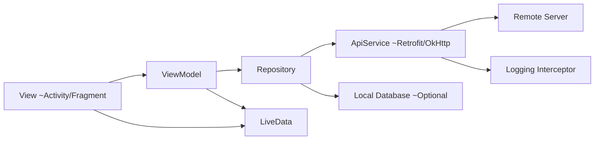

# High Level Architecture of mvvm pattern

To design an Android mobile app for making API calls using the **MVVM (Model-View-ViewModel)** pattern, where the app logs all HTTP details (like URL, headers, request body, and response), we need to break down the architecture into logical layers that handle separation of concerns efficiently.

### Key Components of the System:

1. **Model Layer**: Handles data and business logic, including API calls and parsing responses.
2. **ViewModel Layer**: Acts as a mediator between the View and Model, exposing LiveData to the View.
3. **View Layer**: The UI layer that observes the data and displays it to the user.
4. **Repository**: This manages data sources (API calls, local storage, etc.) and abstracts the data layer from the ViewModel.
5. **HTTP Client**: For making API calls, OkHttp (with interceptors) will be used to log requests and responses.
6. **Logging**: To log URL, headers, request body, and response, we'll use interceptors in OkHttp.

### High-Level Architecture of the MVVM Pattern



### Detailed Design of Each Component

### 1. **Model Layer**

The **Model** layer will handle all API interactions and data parsing. It includes:

- The **API service** (implemented using Retrofit with OkHttp as the underlying client).
- The **data classes** for requests and responses.

### Example API Service (Retrofit)

```kotlin
interface ApiService {
    @GET("users")
    suspend fun getUsers(): Response<List<UserResponse>>

    @POST("login")
    suspend fun login(@Body request: LoginRequest): Response<LoginResponse>
}

```

### 2. **ViewModel Layer**

The **ViewModel** is responsible for preparing and managing the data for the UI. It also handles the logic for when to call the API and how to expose the data to the View using LiveData or StateFlow.

### Example ViewModel

```kotlin
class MainViewModel(private val repository: MainRepository) : ViewModel() {

    // Expose API response to the UI
    val usersLiveData: LiveData<List<UserResponse>> = liveData {
        val result = repository.getUsers()
        emit(result)
    }

    // Expose login response
    val loginResult: LiveData<Result<LoginResponse>> = liveData {
        val response = repository.login(LoginRequest("username", "password"))
        emit(response)
    }
}

```

### 3. **Repository Layer**

The **Repository** serves as the single source of truth for data in the app. It abstracts the data layer (either from API or local DB) and exposes a clean interface to the ViewModel.

### Example Repository

```kotlin
class MainRepository(private val apiService: ApiService) {

    // Function to fetch users
    suspend fun getUsers(): List<UserResponse>? {
        val response = apiService.getUsers()
        if (response.isSuccessful) {
            return response.body()
        }
        return null
    }

    // Function to login
    suspend fun login(request: LoginRequest): Result<LoginResponse> {
        val response = apiService.login(request)
        return if (response.isSuccessful) {
            Result.success(response.body()!!)
        } else {
            Result.failure(Throwable(response.errorBody()?.string()))
        }
    }
}

```

### 4. **HTTP Client (with Logging Interceptor)**

We use **OkHttp** with **interceptors** to log the full request (URL, headers, body) and response.

### OkHttpClient Setup with Logging Interceptor

```kotlin
val loggingInterceptor = HttpLoggingInterceptor { message ->
    Log.d("API_LOG", message)
}.apply {
    level = HttpLoggingInterceptor.Level.BODY // Logs the body, headers, and request
}

val okHttpClient = OkHttpClient.Builder()
    .addInterceptor(loggingInterceptor)  // Add logging interceptor
    .build()

val retrofit = Retrofit.Builder()
    .baseUrl("https://api.example.com/")
    .client(okHttpClient)  // Set custom OkHttp client
    .addConverterFactory(GsonConverterFactory.create())  // Use Gson for serialization
    .build()

val apiService: ApiService = retrofit.create(ApiService::class.java)

```

The **`HttpLoggingInterceptor`** will log:

- **URL**: The full request URL.
- **Headers**: The headers of the request and response.
- **Request body**: The data sent to the server in POST or PUT requests.
- **Response body**: The data received from the server.

### 5. **View Layer**

The **View** (usually an Activity or Fragment) observes the **LiveData** from the ViewModel and updates the UI accordingly.

### Example Activity

```kotlin
class MainActivity : AppCompatActivity() {

    private val viewModel: MainViewModel by viewModels()

    override fun onCreate(savedInstanceState: Bundle?) {
        super.onCreate(savedInstanceState)
        setContentView(R.layout.activity_main)

        // Observe the LiveData from ViewModel
        viewModel.usersLiveData.observe(this, Observer { users ->
            // Update UI with user data
            displayUsers(users)
        })

        viewModel.loginResult.observe(this, Observer { result ->
            result.onSuccess { loginResponse ->
                // Handle successful login
                Log.d("LOGIN", "Success: ${loginResponse.token}")
            }.onFailure { error ->
                // Handle login error
                Log.e("LOGIN", "Error: ${error.message}")
            }
        })
    }

    private fun displayUsers(users: List<UserResponse>) {
        // Display user data in the UI
    }
}

```

### Error Handling and Logging

1. **Error Handling**: When the API call fails, handle the error in the ViewModel and propagate it to the View. This is achieved using the `Result` class to handle success or failure.
2. **Logging**: Using OkHttp’s `HttpLoggingInterceptor`, we can log the full details of each HTTP request and response. The logging interceptor can log the following:
    - **Request URL**: `GET https://api.example.com/users`
    - **Request Headers**: `Authorization: Bearer token123`
    - **Request Body**: `{"username":"john","password":"password123"}`
    - **Response Body**: `{"id":1,"name":"John Doe"}`

The logs can be observed in the **Logcat** of Android Studio.

### Example of Log Output

```mathematica
D/API_LOG: --> POST https://api.example.com/login
D/API_LOG: Content-Type: application/json
D/API_LOG: {"username":"john","password":"password123"}
D/API_LOG: --> END POST
D/API_LOG: <-- 200 OK https://api.example.com/login
D/API_LOG: Content-Type: application/json
D/API_LOG: {"token":"abcd1234"}
D/API_LOG: <-- END HTTP (200 OK)

```

### Optional Enhancements

1. **Error Retry Mechanism**: You can add an interceptor to retry failed requests if certain conditions (like network issues) are met.
2. **Caching**: Use OkHttp’s caching mechanism to store API responses locally and serve them when offline.
3. **Offline Support**: Implement Room or another local database to store data when offline and sync with the server when online.

### Conclusion

In this **MVVM**-based Android app architecture:

- The **Model** handles API requests and data logic through Retrofit and OkHttp.
- The **ViewModel** exposes the API responses to the **View** through LiveData, handling the logic of when to fetch data.
- The **Repository** abstracts the data sources, managing whether data comes from the API or (optionally) a local cache.
- The **View** (Activity/Fragment) observes LiveData and updates the UI.
- **OkHttp’s logging interceptor** logs all necessary details (URL, headers, request body, and response) for debugging and tracking API calls.

This design separates concerns cleanly and follows the MVVM pattern, making the app scalable, testable, and maintainable.
